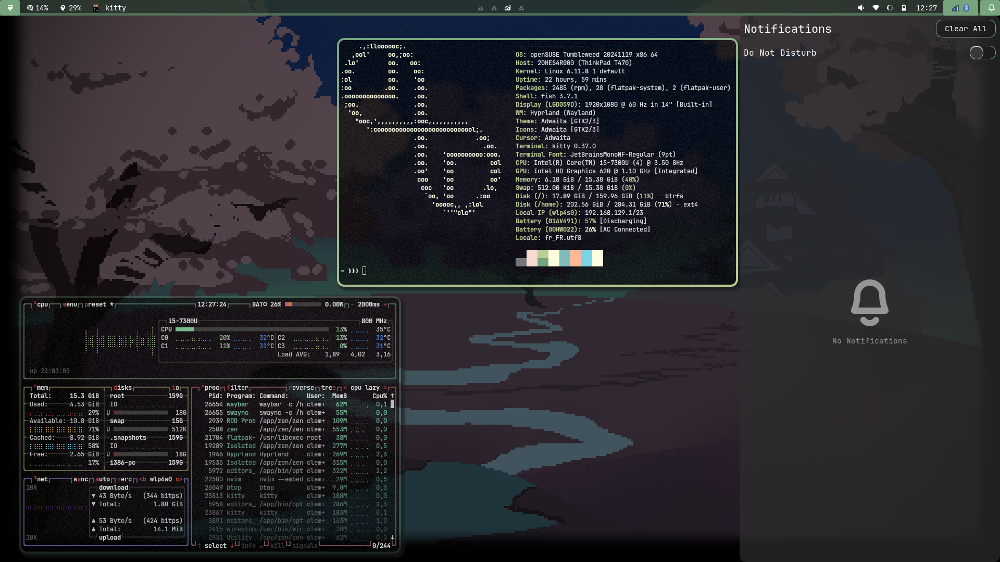
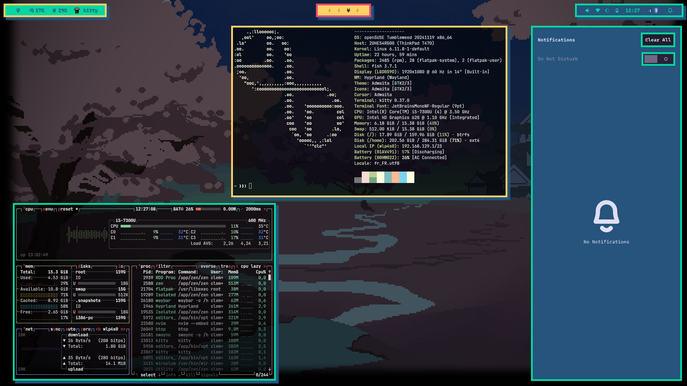
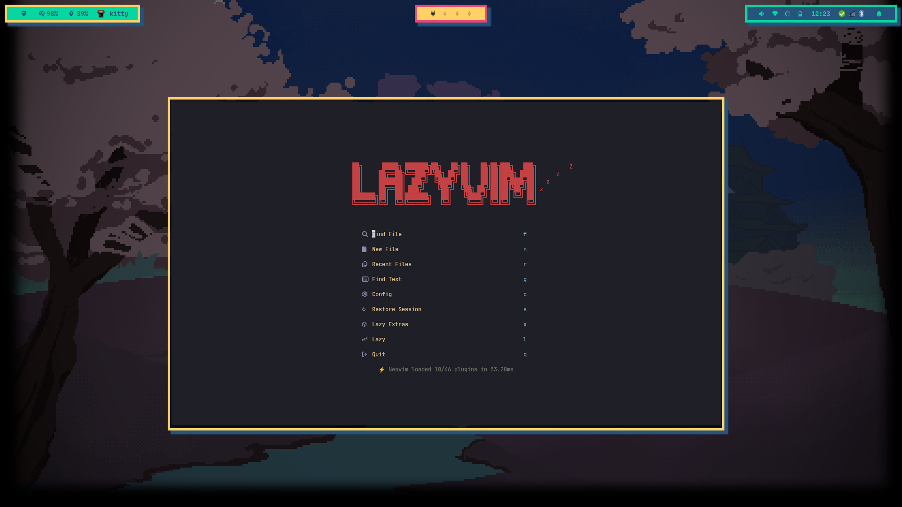
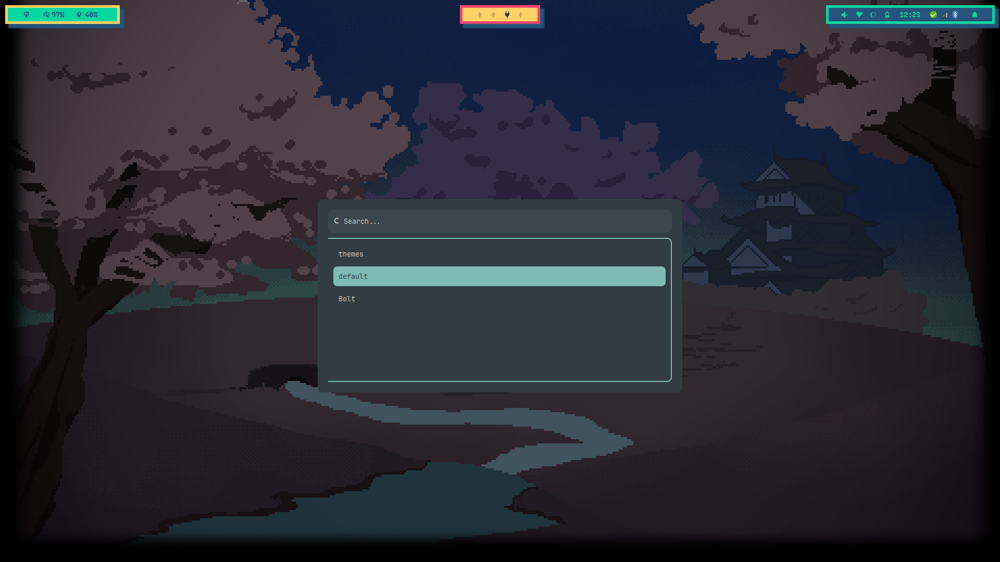

# 🌿 DOTFILES 🐌 
My dotfiles for my hyprland setup. I currently use this setup on my OpenSUSE Tumbleweed laptop. 

I like to keep things simple so don't expect wonders here, just a basic setup that I made on my own that suits my needs. 

I recently added a theme switcher to setup the desktop look and feel depending on what I want on the moment. 

##### ⚠️  *This repo isn't made to be cloned! Use it as an inspiration for your own setup only.*   ⚠️

I kept most things within the hypr folder in order to still be able to use other WMs (mostly Sway), just in case somehing goes wrong.

A huge thanks to adi1090x and every contributor of [this](https://github.com/adi1090x/rofi?tab=readme-ov-file) wonderful project for their fantastic  collection of rofi applets, launchers and powermenus. Check out the repo, it's fantastic.

Thanks to [JaKooLit](https://github.com/JaKooLit/Ja_HyprLanD-dots/blob/main/config/hypr/scripts/volume) for the *volume.sh* script I used and modified.

Thanks also to [Eric Murphy](https://ericmurphy.xyz/) for his [rofi wifi menu](https://github.com/ericmurphyxyz/rofi-wifi-menu) (and sense of humor). Don't hesitate to check out his youtube channel!  

 🔧 What's used?  

- 🖥️    Window Manager: Hyprland
- 🥖    Bar: Waybar
- 🔍    Launcher: Rofi (Wayland)
- 🎨    Wallpaper Manager: Swaybg
- 🔔    Notification Manager: Swaync
- 🛌    Idle Manager: Hypridle
- 🔒     Lock Screen: Hyprlock
- 🌐    Browser: Zen Browser
- 📁    File Manager: Nautilus
- 🐈    Terminal Emulator: kitty
- 🐟    Shell: Fish
- ✏️    Text Editor: VSCodium & LazyVim for light editing (*french keyboard layout and Vim don't match that good*)

## 🖥️ What's it looks like

### Desktop

### Text Editor

### Wallpaper Switcher

### Theme switcher

Thanks to these two people whom worked inspired me for my own dotfiles: 
- [mylinuxforwork](https://github.com/mylinuxforwork/dotfiles/tree/main)
- [kamssiopeia](https://github.com/kamssiopeia/hyprland-dotfiles/tree/develop/.config) 

I really hope that i cited everyone and their work. If you encounter a modified version of your code please contact me and I'll add you to the list of references. 