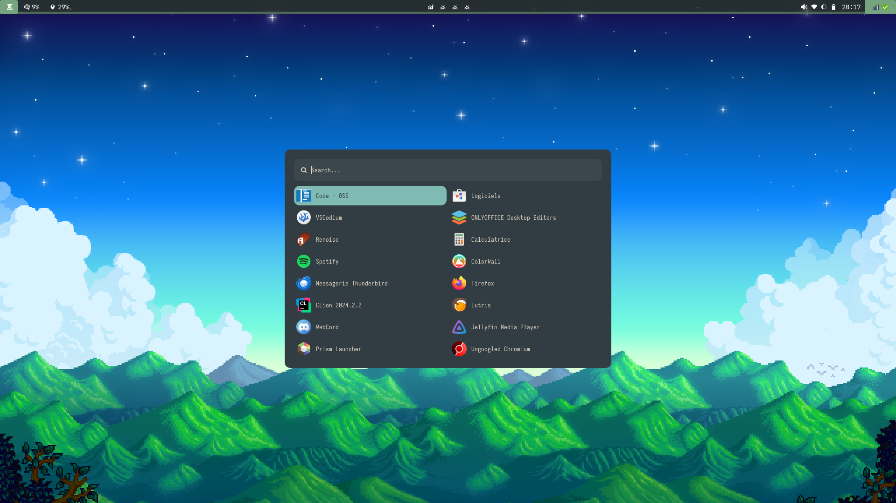
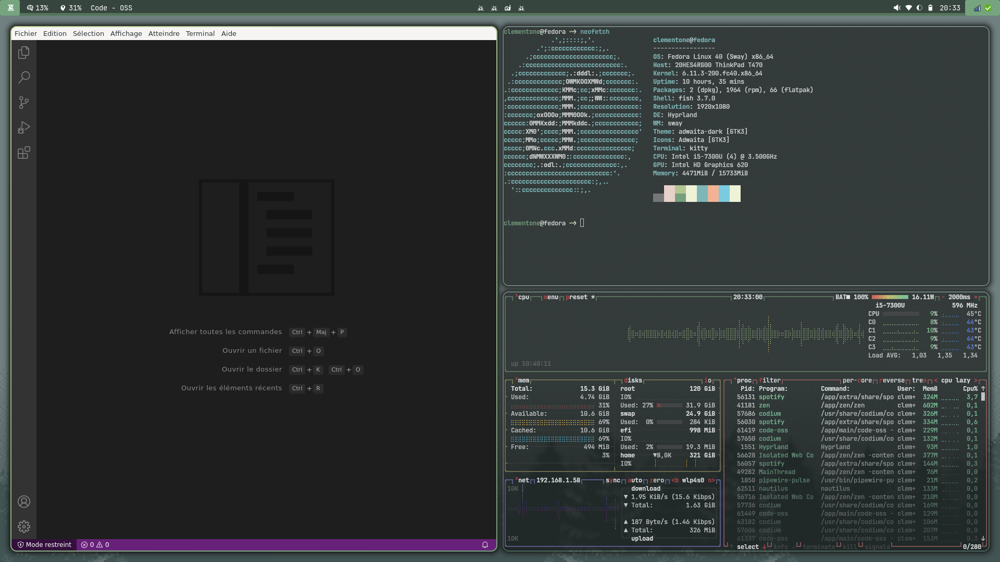
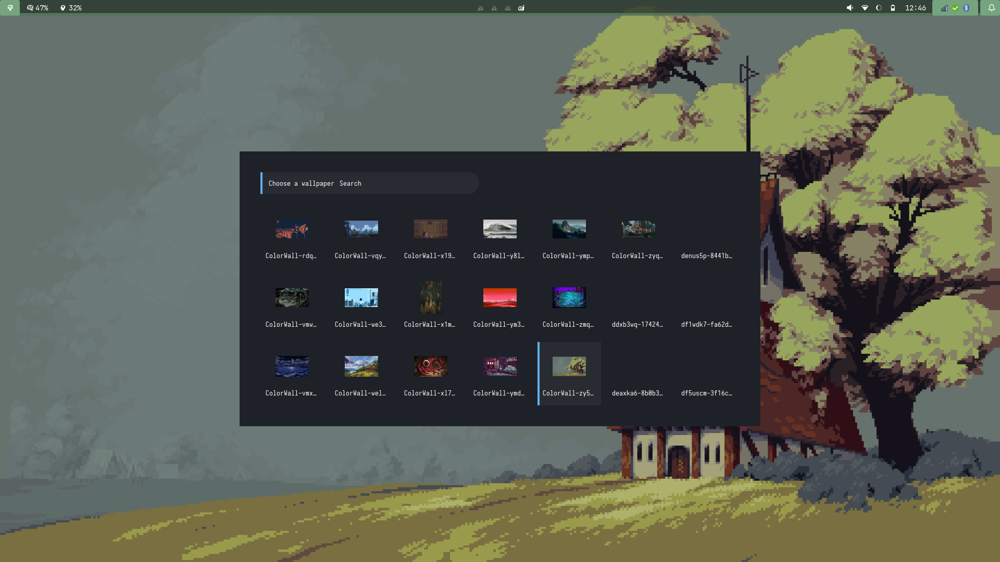

# 🌿 DOTFILES 🐌 
My dotfiles for my hyprland setup. I currently use this setup on my fedora laptop (based on fedora sway) and my OpenSUSE Tumbleweed desktop. 

I like to keep things simple so don't expect wonders here, just a basic setup that I made on my own that suits my needs. 

##### ⚠️  *This repo isn't made to be cloned! Use it as an inspiration for your own setup only.*   ⚠️

I kept most things within the hypr folder in order to still be able to use Sway (on my Fedora Laptop), just in case somehing goes wrong.

A huge thanks to adi1090x and every contributor of [this](https://github.com/adi1090x/rofi?tab=readme-ov-file) wonderful work project for their fantastic  collection of rofi applets, launchers and powermenus. Check out the repo, it's fantastic.

Thanks also to [Eric Murphy](https://ericmurphy.xyz/) for his [rofi wifi menu](https://github.com/ericmurphyxyz/rofi-wifi-menu) (and sense of humor). Don't hesitate to check out his youtube channel! 

 🔧 What's used?  

- 🖥️    Window Manager: Hyprland
- 🥖    Bar: Waybar
- 🔍    Launcher: Rofi (Wayland)
- 🎨    Wallpaper Manager: Swaybg
- 🔔    Notification Manager: Swaync
- 🛌    Idle Manager: Hypridle
- 🔒    Lock Screen: Hyprlock
- 🌐    Browser: Zen Browser
- 📁    File Manager: Nautilus
- 🐈    Terminal Emulator: kitty
- 🐟    Shell: Fish

## 🖥️ What's it looks like

### Launcher

### Desktop

### Wallpaper Switcher

Thanks to these two people whom worked inspired me for my own dotfiles: 
- [mylinuxforwork](https://github.com/mylinuxforwork/dotfiles/tree/main)
- [kamssiopeia](https://github.com/kamssiopeia/hyprland-dotfiles/tree/develop/.config) 

